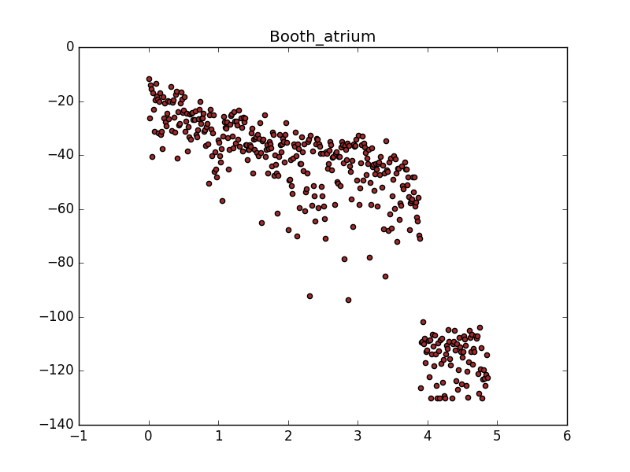

# Reverb Analysis

Directory for reverb recognition analysis scripts and output files.

## Directories

* <code>output/</code>: Directory containing exported reverb signature of impulse responses and generated plots.

## Files

* <code>example.py</code>: Python script which automates impulse processing and showcases the reverb analysis.
* <code>impulse_processing.py</code>: Python script to process and export reverb signature of impulse responses.
* <code>impulses.csv</code>: Csv file containing a list of the impulses in <code>../impulses/</code>.
* <code>k_neighbors.py</code>: Python script that implements a k-nearest neighbors analysis for frequency spectra.
* <code>reverb_analysis.py</code>: Python script that performs recognition of the reverb signature in a wet sound.
* <code>test_reverb_analysis.py</code>: Python script that tests the accuracy of the reverb analysis algorithm.

## tl;dr

Run <code>example.py</code> which will,

1. analyze the impulse responses in <code>../impulses/</code> using the <code>impulse_processing.py</code> script and export to disk their reverb signature,
2. run one usage example of the <code>reverb_analysis.py</code> script and return the results of the recogniztion algorithm while also generating a set of plots saved to disk to <code>output/plots/</code>.

```sh
$ python example.py
```

Subsequently run <code>test_reverb_analysis.py</code> which will produce an accuracy rating for the algorithm at recognizing the correct reverb signature of a wet sound.

```sh
$ python test_reverb_analysis.py
```

## Accuracy of the reverb recognition analysis

In order to test the accuracy of the reverb recognition analysis you can execute <code>test_reverb_analysis.py</code> as instructed above which has a verbose output and details its process.

In essence, it will check how accurate it is at successfully recognizing the reverb signature for sounds whose reverb was produced by the convolution reverb and for sounds that have a natural reverb signature (i.e. they were played and recorded within a space with reverb). <em>If the correct reverb signature is present within the top three results, it will count that as successful hit.</em>

The algorithm is more effective at recognizing the reverb if this was produced by the convolution reverb.

At the moment it outputs an accuracy rating of ..., meaning that ...% of the time it recognizes the correct reverb signature within its top three choices.

## How it works

Because this procedure is unique to this project we walk you through an overall view of the reverb analysis algorithm.

### Processing the impulse responses

The impulse responses contain the most clear information about the reverb of a space. This reverb can be visualized as the decay of the intensity in a given frequency bin. We found that the reverb decay is most clear in the lowest frequency bin corresponding to frequencies in the hundreds of Hz.




