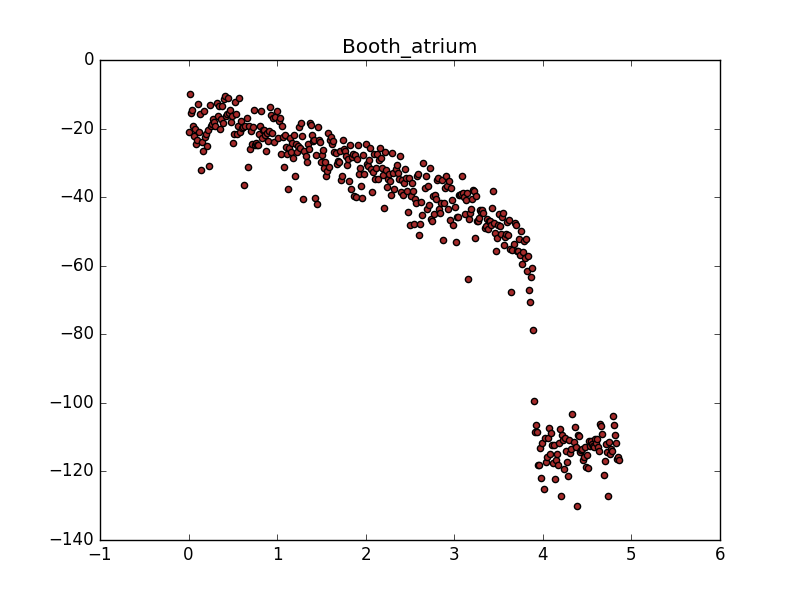
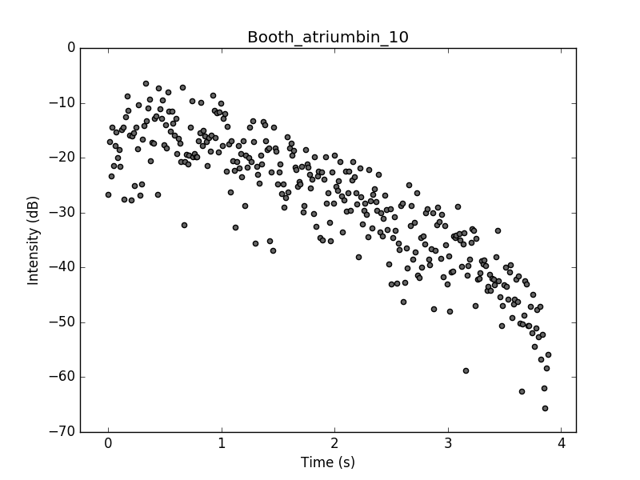
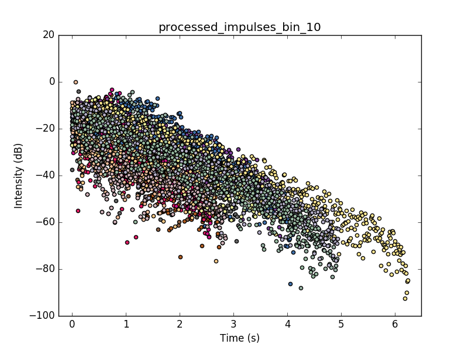
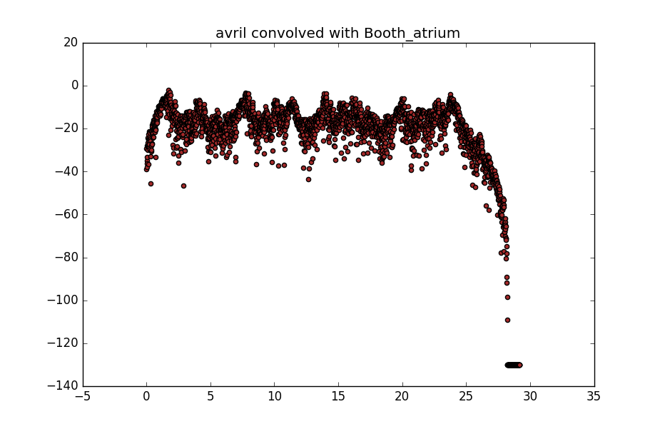
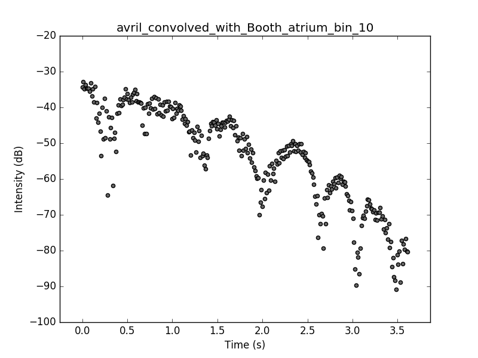
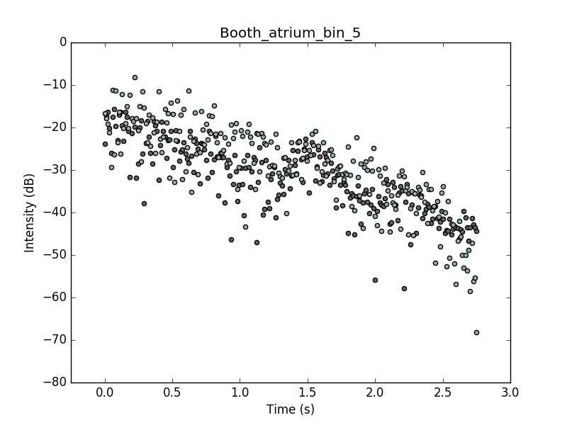

# Reverb Analysis

Directory for reverb recognition analysis scripts and output files.

## Directories

* <code>output/</code>: Directory containing exported reverb signature of impulse responses and generated plots.

## Files

* <code>example.py</code>: Python script which automates impulse processing and showcases the reverb analysis.
* <code>impulse_processing.py</code>: Python script to process and export reverb signature of impulse responses.
* <code>impulses.csv</code>: Csv file containing a list of the impulses in <code>../impulses/</code>.
* <code>k_neighbors.py</code>: Python script that implements a k-nearest neighbors analysis for frequency spectra.
* <code>reverb_analysis.py</code>: Python script that performs recognition of the reverb signature in a wet sound.
* <code>test_reverb_analysis.py</code>: Python script that tests the accuracy of the reverb analysis algorithm.

## tl;dr

Run <code>example.py</code> which will,

1. analyze the impulse responses in <code>../impulses/</code> using the <code>impulse_processing.py</code> script and export to disk their reverb signature,
2. run one usage example of the <code>reverb_analysis.py</code> script and return the results of the recogniztion algorithm while also generating a set of plots saved to disk to <code>output/plots/</code>.

```sh
$ python example.py
```

Subsequently run <code>test_reverb_analysis.py</code> which will produce an accuracy rating for the algorithm at recognizing the correct reverb signature of a wet sound.

```sh
$ python test_reverb_analysis.py
```

If you would like to run <code>reverb_analysis.py</code> with your own audio files, make sure you copy them to either <code>../samples/</code> or <code>../download_files/</code>.

## Accuracy of the reverb recognition analysis

In order to test the accuracy of the reverb recognition analysis you can execute <code>test_reverb_analysis.py</code> as instructed above which has a verbose output and details its process.

In essence, it will check how accurate it is at successfully recognizing the reverb signature for sounds whose reverb was produced by the convolution reverb and for sounds that have a natural reverb signature (i.e. they were played and recorded within a space with reverb). <em>If the correct reverb signature is present within the top three results, it will count that as successful hit.</em>

The algorithm is more effective at recognizing the reverb if this was produced by the convolution reverb.

At the moment it outputs an accuracy rating of 18% for convolution reverbs, meaning that 18% of the time it recognizes the correct reverb signature within its top three choices. The accuracy rating for real reverb sounds is 12%. We believe these values can be improved on later iterations of this software.

## How it works

Because this procedure is unique to this project we walk you through an overall view of the reverb analysis algorithm.

### Processing the impulse responses

The impulse responses contain the most clear information about the reverb of a space. This reverb can be visualized as the decay of the intensity in a given frequency bin. We found that the reverb decay is most clear in the lower range of frequency bins corresponding to frequencies in the hundreds of Hz.

Below is an image of the spectrum of Booth_atrium in the 10th frequency bin. The x-axis is time in seconds and the y-axis is intensity in decibels.


This needs to be processed to get rid of the meaningless points below -80 dB. <code>impulse_processing.py</code> does this automatically for every impulse at the desired frequency bins.


The impulse responses are now processed and the resulting reverb signature is exported to disk for future usage.

Having done that we can visualize the similarities and differences between these reverb signatures.



Each color in the above plot represents a different reverb space. The challenge is clear from this image: the reverb signatures are distinct but have similar structure (i.e. they cluster across the time domain with the same behavior generally speaking).

That is the challenge of the reverb recognition analysis, a challenge which is met using a k-nearest neighbors appraoch.

### The wet sound

You can provide a wet sound. A wet sound needs to have a reverb associated with it. This reverb can originate naturally from a space or it can be simulated by means of the convolution reverb.

The next step is to extract the reverb signature from the wet sound. This is best done in the final seconds from the sound ending since it is here that the source signal fully stops and the reflection signals remain.

Below is the full length frequency spectrum at bin 10 of the <code>avril.aif</code> sound file convolved with <code>Booth_atrium.wav</code>.



<code>reverb_analysis.py</code> can extract the reverb signature from this sound file to obtain the plot below.



If the reverb signature is too noisy and does not represent some form of clear linear decay (in logarithmic scale), then <code>reverb_analysis.py</code> determines that there is no reverb signature at that specific frequency bin.

### Matching the impulse response decay to the audio file reverb signature

Now that we have both reverb signatures extracted, we are ready to carry out a comparison and determine how good a match this is.

The premise for this is the following. Given a clean reverb signature from an audio file with an initial intensity I_0, it should decay over time with the same rate as the impulse response at that same initial intensity I_0. <code>reverb_analysis.py</code> makes sure to make this matching and finds a common intensity I_0 for both the reverb signature of the audio file and for the impulse response.

This matching can be visualized in the plot below. The data in green represents the <code>Booth_atrium.wav</code> reverb while the data in gray represents the <code>avril_convolved_with_Booth_atrium.wav</code> extracted reverb signature.



At this point and for every frequency specified against every impulse response, a k-nearest neighbor analysis can be performed. Running a k=3 analysis returns a most likely match with **Booth_atrium** out of 17 possible impulse response spaces. This happens to be the correct answer. The result represents the shortest mean distance between k points. These results (including the plots) can be replicated by running the following command from the <code>reverb_analysis/</code> folder.

```sh
$ python3 reverb_analysis.py ../output/wavfiles/avril_convolved_with_Booth_atrium.wav 3 True
A lower value means a better match.
A value of 0.0 for k=1 means the match is exact.
{'Booth_atrium': 7.3887567890704302, 'Rockefeller_far': 7.9773010456106146, 'Rockefeller_center': 7.6713388716633464}
```


